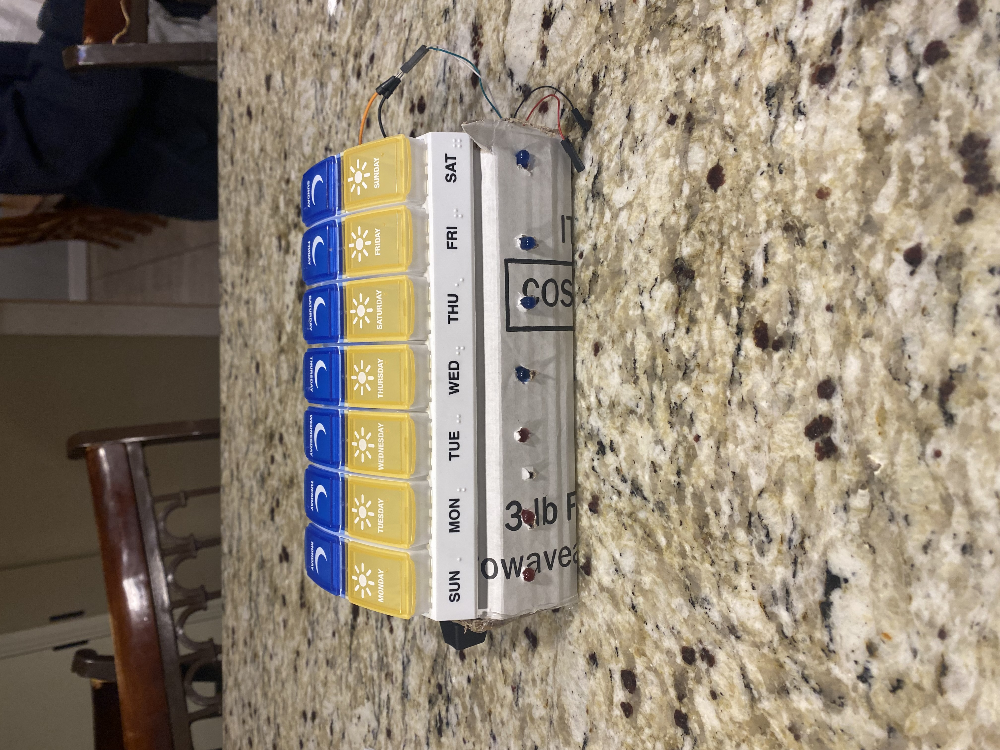
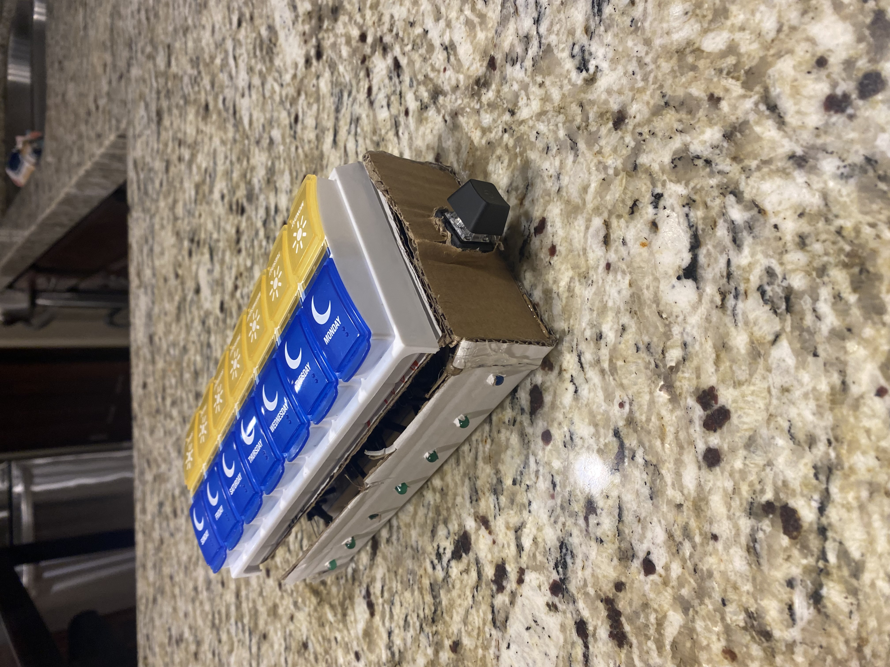
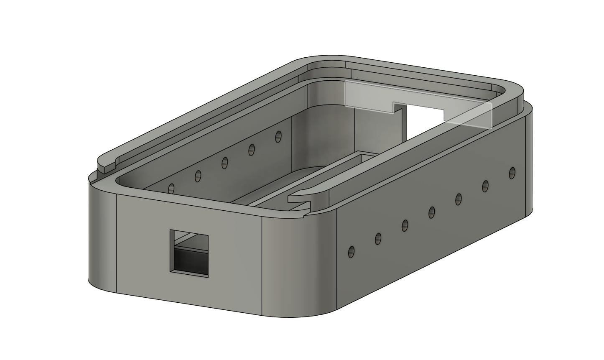
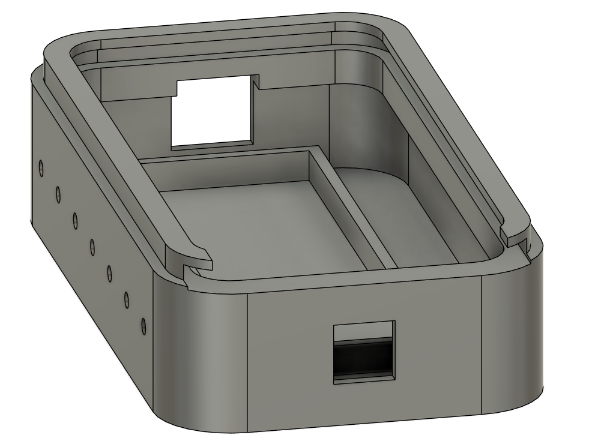
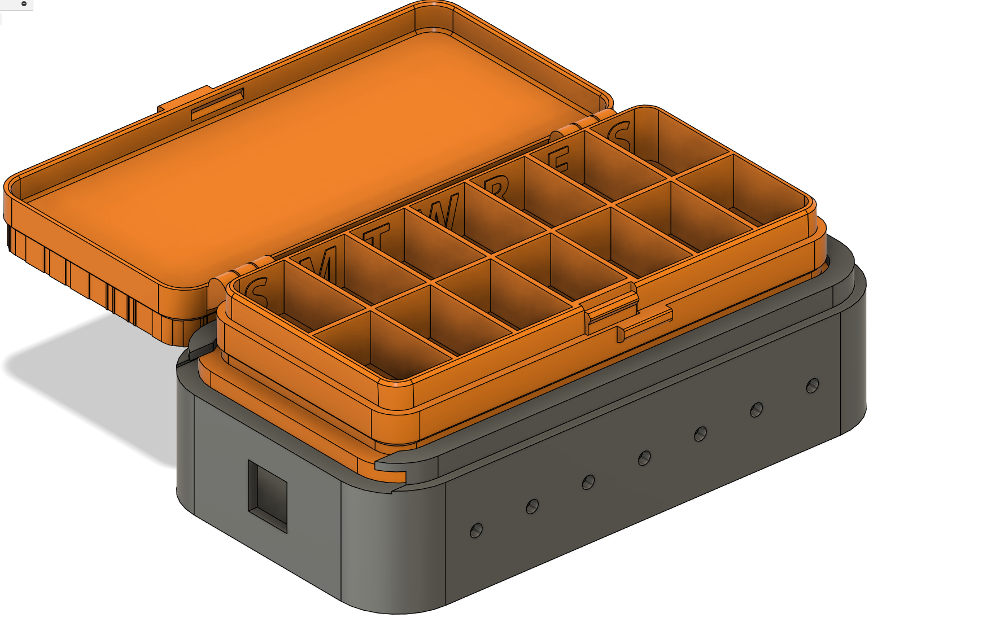

# Automatic-Pill-Box
This is a project made by Zachary Cromar, Paige Cromar, and Max Sengpraseut. The mentor for this project is Alexander Cromar. This project will utilize the ESP32 Microcontroller.
# # Materials and Methods

# Design Goal and Purpose
We are making a pill  box that reminds people to take there medication if people forget to take there medication it can be very bad and even lead to death. This box will help people with remember taking pills at whatever time in the day that is necessary. This box will activate on a timer to remind the user to take there pills morning and night. At a set time of day a buzzer and a light will go off. The light corresponding to the current pill capsule will light up. The buzzer will continue to beep until the user pressess a button to turn it off.  
# Bill of Materials 

| **Part Name**             | **Amount** | **Description**                                                                                                      |
|---------------------------|------------|----------------------------------------------------------------------------------------------------------------------|
| ESP32 Module (Microcontroller)              | 1          | A microcontroller that will be used to control the project.   |
| Wires| Numerous          | Connect to all the components   |
|LED Lights | 14 |Lights will illuminate to show what day it is|
|Access to a 3D printer and filament| |This will be used to construct the box|
|Resistor|1|This will be used to limit current into the LED|
|Breadboard|1|This will be used to connect components|
|Access to solder iron| | This will be needed to solder components|
|Buzzer|1|Buzzer will go off to remind the user to take pills |
|Button|1|Button is used to turn off the alarm|

# Construction steps
1. Create a cardboard prototype. This prototype will hold all components and allow us to visualize what we want the project to look like in real life.
2. Create a wiring layout to connect systems. This wiring diagram will be created using Voltage laws and the datasheet from the microcontroller.
3. Create a program for the microcontroller. The program for the microcontroller will be written step by step using VScode with help from Alex Cromar.
4. Test the program to make sure it works. We will test the program by ensuring the lights are working properly.
5. Assemble the prototype in cardboard. We will then use the prototype created earlier and fit the electronics to make sure things fit properly.
6. Design 3D print enclosure. We can then fix mistakes from the prototype and design in Fusion 360 with the help of Alex.
7. Create the final design. We will 3D print with the help of Alex and assemble the electronics inside.
8. We will finish by testing the final design and ensuring all design goals are met.

# Testing the prototype and Program
We will test the program by making it so that the button when pressed twice will advance the box to the next day. We can test the program using a clock to make sure that the timer is working properly. We will need to test that the LED lights will turn on according to the right time. 
# Schematics

# Risk and Safety
1. solder iron burns 
2. Electrocuted by loose wires
3. Scissors and other sharp objects can cut
4. Damaging the micro controller and fry components

All safety measures will be supervised directly by Alex Cromar. To mitigate the risks of burns or electrocution we will be using the appropriate protective equipment. To make sure we do not fry components all changes will be checked by Alex to ensure that they are done properly. 

# Cardboard Prototype

# Source for 3d design 
To make our 3d Design we used this project found on thingiverse as our baseline and built off of it.
https://www.thingiverse.com/thing:4502015

# 3d Design

!
[alt text](3D_Top_Bottom.png)
