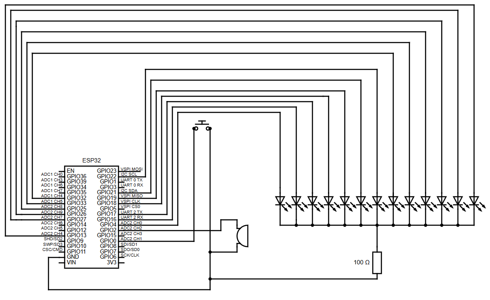

# Automatic-Pill-Box
This is a project made by Zachary Cromar, Paige Cromar, and Max Sengpraseut. The mentor for this project is Alexander Cromar. This project will utilize the ESP32 Microcontroller.
# # Materials and Methods

# Design Goal and Purpose
We are making a pill  box that reminds people to take there medication if people forget to take there medication it can be very bad and even lead to death. This box will help people with remember taking pills at whatever time in the day that is necessary. This box will activate on a timer to remind the user to take there pills morning and night. At a set time of day a buzzer and a light will go off. The light corresponding to the current pill capsule will light up. The buzzer will continue to beep until the user pressess a button to turn it off.  
# Bill of Materials 

| **Part Name**             | **Amount** | **Description**                                                                                                      |
|---------------------------|------------|----------------------------------------------------------------------------------------------------------------------|
| ESP32 Module (Microcontroller)              | 1          | A microcontroller that will be used to control the project.   |
| Wires| Numerous          | Connect to all the components   |
|LED Lights | 14 |Lights will illuminate to show what day it is|
|Access to a 3D printer and filament| |This will be used to construct the box|
|Resistor|1|This will be used to limit current into the LED|
|Breadboard|1|This will be used to connect components|
|Access to solder iron| | This will be needed to solder components|
|Buzzer|1|Buzzer will go off to remind the user to take pills |
|Button|1|Button is used to turn off the alarm|

# Construction steps
 1. Create a cardboard prototype.
 2. Create a wiring layout to connects systems.
 3. Create program for the microcontroller.
 4. Test program to make sure it works.
 5. Assemble prototype in cardboard.
 6. Design 3D print enclosure.
 7. Create the final design.
# Testing the prototype and Program
We will test the program by making it so that the button when pressed twice will advance the box to the next day. We can test the program using a clock to make sure that the timer is working properly. We will need to test that the LED lights will turn on according to the right time. 
# Schematics

# Risk and Safety
1. solder iron burns 
2. Electicuted by loose wires
3. Scizzors and other sharp objects can cut
4. Dmaging the micro controller and fry components

